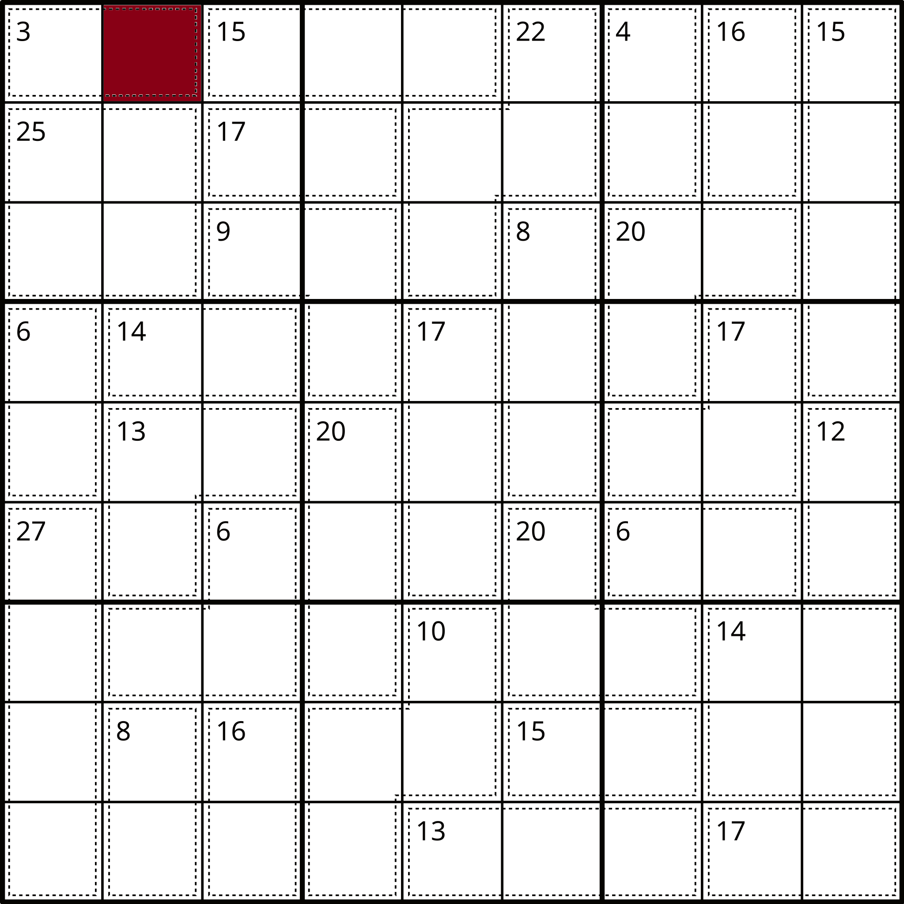

# Killer Sudoku Solver

> This is a rewrite in kotlin of my Computer Science dissertation project. I Studied `Computer Science with a Year in Industry (2006-2010)` with [IBM][7] `(2008-2009)` at [Manchester University][8]. I achieved a 1st class honours for this project and was in the top 10 of the year.
>
> The goals of this project is to be able to take any Killer Sudoku Grid and then be able to solve them from said grid.
>
> I should be able to demonstrate solving by [brute force][5], but also be able to solve using [human techniques][9].
>
> The human provided techniques should also be able to graphically display or verbally describe how to solve said Sudoku Grid

## Classic Sudoku

> Classic sudoku has been around for years and can easily be solved through brute force. The aim of this project is to show and demonstrate how to solve example puzzles. Show techniques and provide solutions.
>
> A simple brute force algorithm will be provided to show how to solve a [well-posed puzzle][1]
>
> Further algorithms will be provided with a [human style UX][6] to help the user learn how to solve the puzzles

## Rules of Sudoku

> In [classic Sudoku](#classic-sudoku), the objective is to fill a 9 × 9 grid with digits so that each [column](#Column), each [row](#Row), and each of the nine 3 × 3 sub-grids that compose the grid ([nonet](#Nonet)) contains all the digits from 1 to 9. The puzzle setter provides a partially completed grid, which for a [well-posed puzzle][1] has a single solution.

### Examples of Sudoku Grids

The below sample grids are taken from https://en.wikipedia.org/wiki/Sudoku

<table>

  <colgroup>
    <col span="1" style="width: 30%;">
  </colgroup>

<thead>
    <tr>
      <th>Example Sudoku Grid</th>
      <th>Example Hard Sudoku Grid</th>
    </tr>
  </thead>
  <tbody>
    <tr>
      <td style="text-align: center; vertical-align: middle;">  </td>
      <td style="text-align: center; vertical-align: middle;">  </td>
    </tr>
  </tbody>

  <colgroup>
    <col span="1" style="width: 30%;">
  </colgroup>

<thead>
    <tr>
      <th>Example Solved Grid Via Brute Force</th>
      <th>Example Solved Grid</th>
    </tr>
  </thead>

<tbody>
    <tr>
      <td style="text-align: center; vertical-align: middle;">  </td>
      <td style="text-align: center; vertical-align: middle;">  </td>
    </tr>
  </tbody>

</table>

## Killer Sudoku Grid

### Rules of Killer Sudoku

> The objective is to fill the grid with numbers from 1 to 9 in a way that the following conditions are met:
>
> * Each [row](#Row), [column](#Column), and [nonet](#Nonet) contains each number exactly once.
> * The sum of all numbers in a [cage](#Cage) must match the small number printed in its corner.
> * No number appears more than once in a [cage](#Cage). (This is the standard rule for killer sudokus, and implies that no [cage](#Cage) can include more than 9 [cells](#Cell).

### Examples of Killer Sudoku Grids

<table>
  <colgroup>
    <col span="3" style="width: 30%;">
  </colgroup>

  <thead>
    <tr>
      <th>Example Killer Sudoku Grid</th>
      <th>Example Killer Sudoku Grid With Colour</th>
      <th>Example Killer Sudoku Grid Solved</th>
    </tr>
  </thead>
  <tbody>
    <tr>
      <td style="text-align: center; vertical-align: middle;">  </td>
      <td style="text-align: center; vertical-align: middle;">  </td>
      <td style="text-align: center; vertical-align: middle;">  </td>
    </tr>
  </tbody>

</table>

### [Terminology](https://en.wikipedia.org/wiki/Glossary_of_Sudoku)

> Below are examples of the technical names of what we will be describing in the domain space of sudoku.

#### Cell

> A single square that contains one number in the grid

<table>
  <colgroup>
    <col span="3" style="width: 30%;">
  </colgroup>

  <thead>
    <tr>
      <th>Example Sudoku Grid Cells</th>
      <th>Example Sudoku Grid Cell Coloured</th>
      <th>Example Sudoku Grid Cell Coloured With Value Set</th>
    </tr>
  </thead>
  <tbody>
    <tr>
      <td style="text-align: center; vertical-align: middle;">  </td>
      <td style="text-align: center; vertical-align: middle;">  </td>
      <td style="text-align: center; vertical-align: middle;">  </td>
    </tr>
  </tbody>

</table>

#### Row

> A horizontal line of 9 cells

#### Column

> A vertical line of 9 cells

#### Nonet

> A 3×3 grid of cells, as outlined by the bolder lines in the diagram above; also called a box

#### Cage

> The grouping of cells denoted by a dotted line or by individual colours.

#### House

> Any non-repeating set of 9 cells: can be used as a general term for "row, column, or nonet" (or, in Killer X variants, "long diagonal")

### Solving Techniques

### Code Location

[Sonar Cloud](https://sonarcloud.io/summary/overall?id=ashfrench_killer-sudoko)

## Tooling

* [Kotlin][2]
* [Gradle][3]
* [JVM][4]
* [Compose Multi Platform][10]
* [JUnit 5 Extension Model][11]

## How to Build

`./gradlew build`

#### References

[Well Posed Problem][1]

[1]: https://en.wikipedia.org/wiki/Well-posed_problem
[2]: https://kotlinlang.org/
[3]: https://gradle.org/
[4]: https://www.oracle.com/java/technologies/downloads/
[5]: https://en.wikipedia.org/wiki/Brute-force_search
[6]: https://en.wikipedia.org/wiki/User_experience
[7]: https://www.ibm.com
[8]: https://www.cs.manchester.ac.uk/
[9]: https://en.wikipedia.org/wiki/Killer_sudoku#Solving_strategies
[10]: https://www.jetbrains.com/lp/compose-multiplatform/
[11]: https://junit.org/junit5/docs/current/user-guide/#extensions