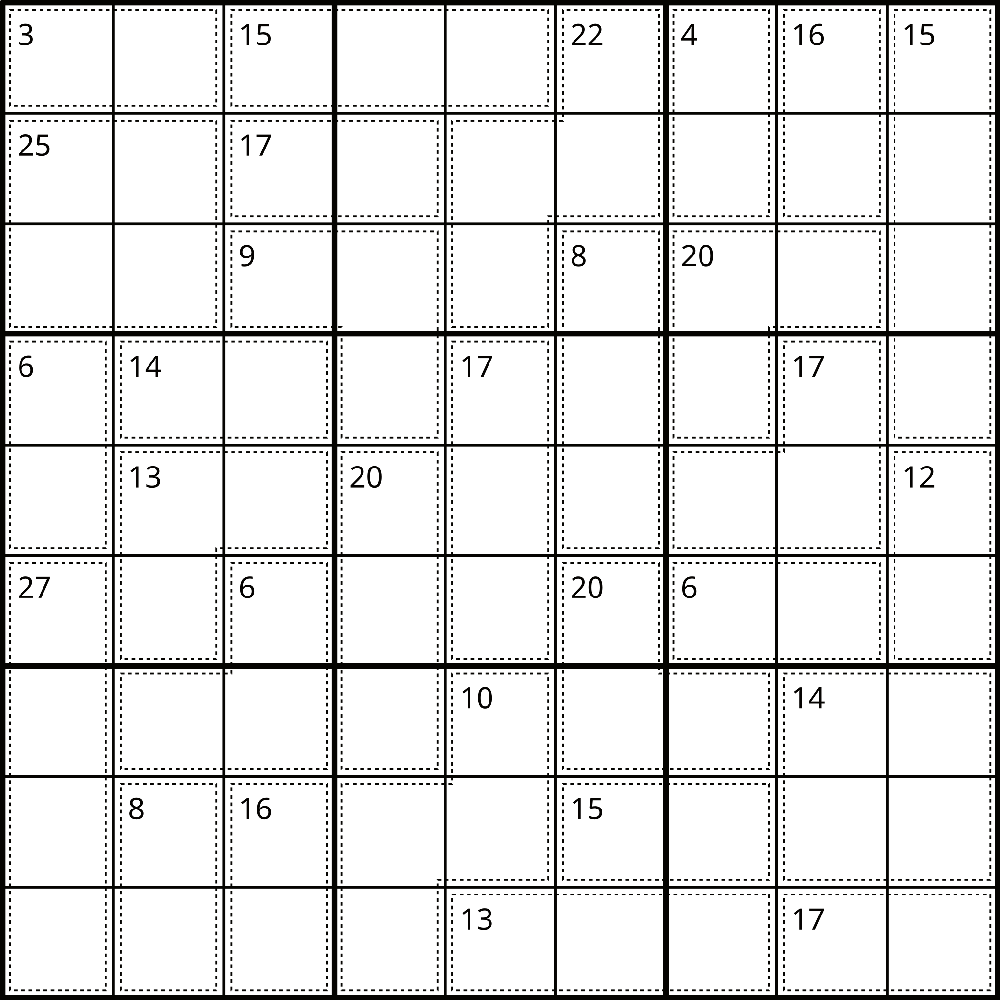

# Killer Sudoku Solver

> This is a rewrite in kotlin of my Computer Science dissertation project. I Studied `Computer Science with a Year in Industry (2006-2010)` with [IBM][1] `(2008-2009)` at [Manchester University][2]. I achieved a 1st class honours for this project and was in the top 10 of the year.
>
> The goals of this project is to be able to take any Killer Sudoku Grid and then be able to solve them from said grid.
>
> I should be able to demonstrate solving by [brute force][3], but also be able to solve using [human techniques][4].
>
> The human provided techniques should also be able to graphically display or verbally describe how to solve said Sudoku Grid
> 
> I will be using https://sudoku.com/ as a source of data to test my algorithms

## [Classic Sudoku](docs/Classic_Sudoku.md)

> Classic sudoku has been around for years and can easily be solved through brute force. The aim of this project is to show and demonstrate how to solve example puzzles. Show techniques and provide solutions.
>
> A simple brute force algorithm will be provided to show how to solve a [well-posed puzzle][15]
>
> Further algorithms will be provided with a [human style UX](#solving-techniques) to help the user learn how to solve the puzzles

## [Killer Sudoku Grid](docs/Killer_Sudoku.md)

> The objective is to fill the grid with numbers from 1 to 9 in a way that the following conditions are met:
>
> * Each [row](docs/Terminology.md#Row), [column](docs/Terminology.md#Column), and [nonet](docs/Terminology.md#Nonet) contains each number exactly once.
> * The sum of all numbers in a [cage](docs/Terminology.md#Cage) must match the small number printed in its corner.
> * No number appears more than once in a [cage](docs/Terminology.md#Cage). (This is the standard rule for killer sudokus, and implies that no [cage](docs/Terminology.md#Cage) can include more than 9 [cells](docs/Terminology.md#Cell).

## Solving Techniques

## Code Location

## Tooling
[][6]
[][7]
[][12]
[][8]
[][14]
[][13]
[][5]

* [Kotlin][6] 
* [Gradle][7] 
* [JVM][8]
* [Compose Multi Platform][9]
* [JUnit 5 Extension Model][10]

## How to Build

`./gradlew build`

## References

[Project Kanban Board][11]

## [Security](SECURITY.md)

## Miscellaneous

[1]: https://www.ibm.com
[2]: https://www.cs.manchester.ac.uk/
[3]: https://en.wikipedia.org/wiki/Brute-force_search
[4]: https://en.wikipedia.org/wiki/Killer_sudoku#Solving_strategies
[5]: https://sonarcloud.io/summary/overall?id=ashfrench_killer-sudoko
[6]: https://kotlinlang.org/
[7]: https://gradle.org/
[8]: https://www.oracle.com/java/technologies/downloads/
[9]: https://www.jetbrains.com/lp/compose-multiplatform/
[10]: https://junit.org/junit5/docs/current/user-guide/#extensions
[11]: https://github.com/users/ashfrench/projects/1/views/1
[12]: https://html.com/html5/
[13]: https://www.markdownguide.org/cheat-sheet/
[14]: https://junit.org/junit5/docs/current/user-guide/
[15]: https://en.wikipedia.org/wiki/Well-posed_problem