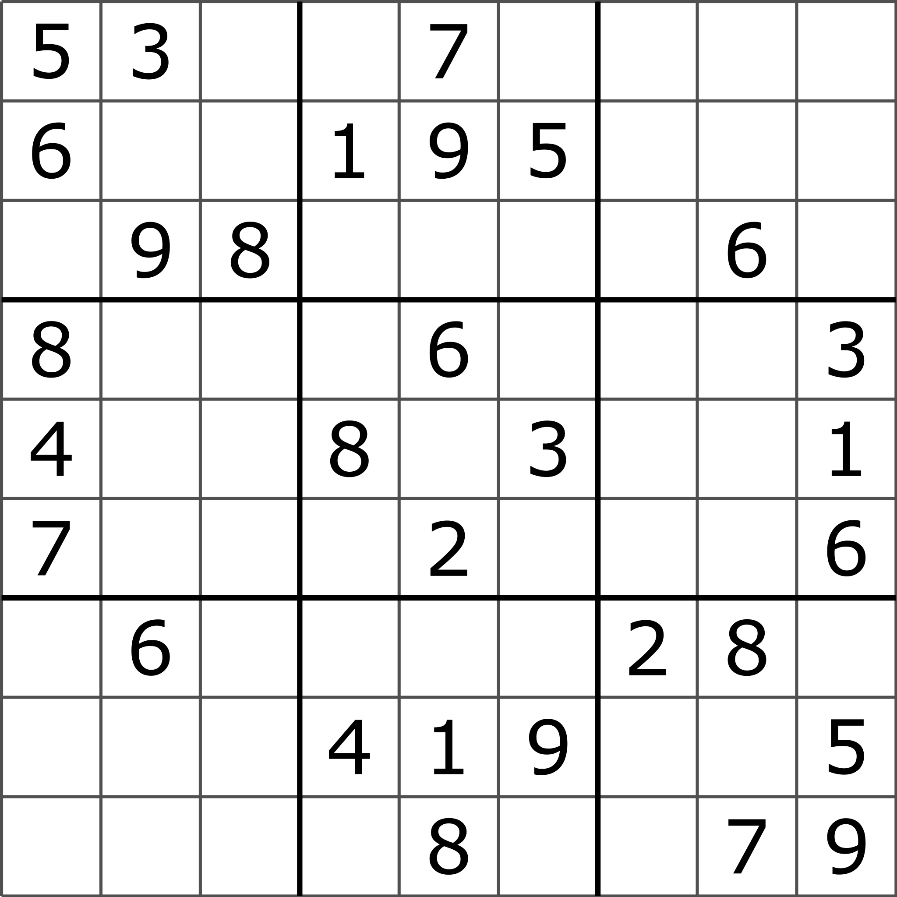
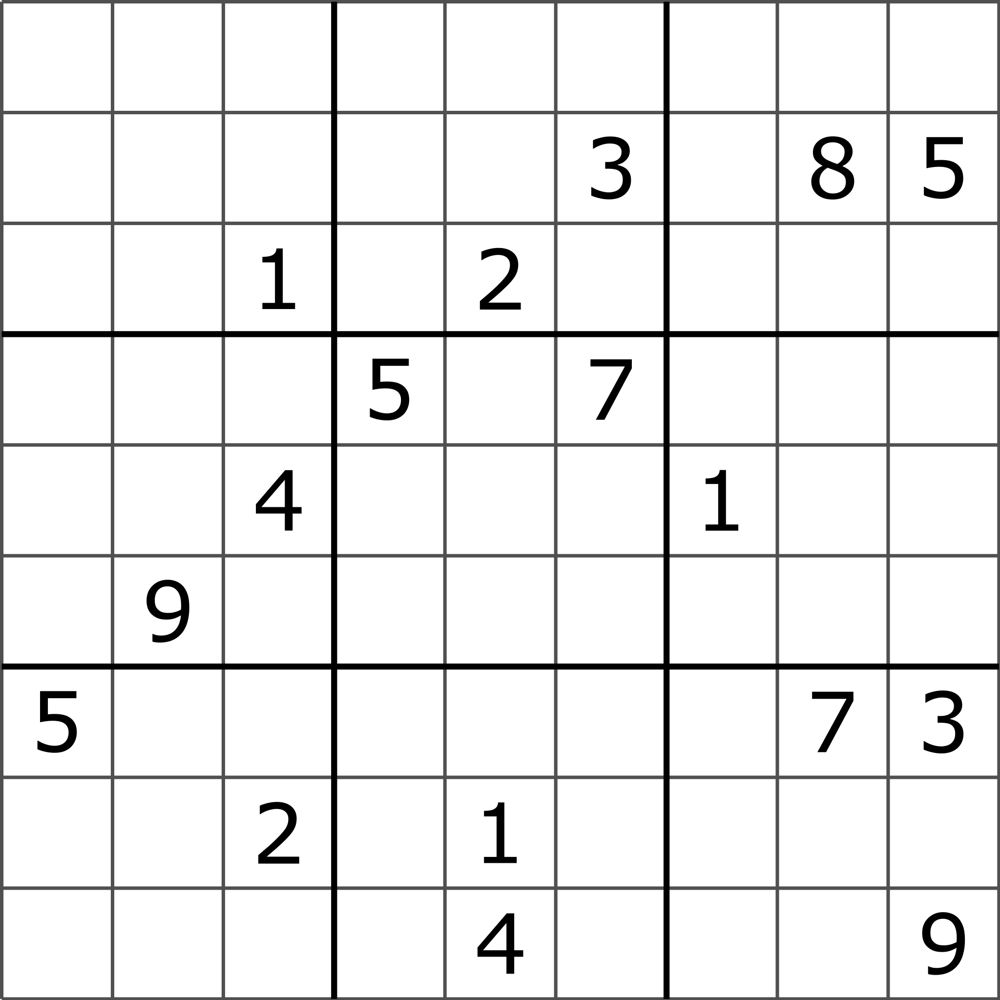
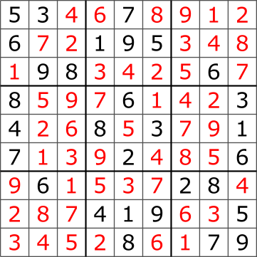

# Classic Sudoku


[Back to README.md](../README.md)

[Back to Documentation Index](./README.md)

> Classic sudoku has been around for years and can easily be solved through brute force. The aim of this project is to
> show and demonstrate how to solve example puzzles. Show techniques and provide solutions.
>
> A simple brute force algorithm will be provided to show how to solve a [well-posed puzzle][1]
>
> Further algorithms will be provided with a [human style UX][2] to help the user learn how to solve the puzzles

## Rules of Sudoku

> In [classic Sudoku](https://en.wikipedia.org/wiki/Sudoku), the objective is to fill a 9 × 9 grid with digits so that
> each [column](./Terminology.md#column), each [row](./Terminology.md#row), and each of the nine 3 × 3 sub-grids that
> compose the grid ([nonet](./Terminology.md#nonet)) contains all the digits from 1 to 9. The puzzle setter provides a
> partially completed grid, which for a [well-posed puzzle][1] has a single solution.

### Examples of Sudoku Grids

The below sample grids are taken from https://en.wikipedia.org/wiki/Sudoku

<table>

  <colgroup>
    <col span="1" style="width: 50%;">
  </colgroup>

<thead>
    <tr>
      <th>Example Sudoku Grid</th>
      <th>Example Hard Sudoku Grid</th>
    </tr>
  </thead>
  <tbody>
    <tr>
      <td style="text-align: center; vertical-align: middle;">  </td>
      <td style="text-align: center; vertical-align: middle;">  </td>
    </tr>
  </tbody>

  <colgroup>
    <col span="1" style="width: 50%;">
  </colgroup>

<thead>
    <tr>
      <th>Example Solved Grid Via Brute Force</th>
      <th>Example Solved Grid</th>
    </tr>
  </thead>

<tbody>
    <tr>
      <td style="text-align: center; vertical-align: middle;">  </td>
      <td style="text-align: center; vertical-align: middle;">  </td>
    </tr>
  </tbody>

</table>

## [Mathematics of Sudoku][3]

> Mathematics can be used to study Sudoku puzzles to answer questions such as "How many filled Sudoku grids are
> there?", "What is the minimal number of clues in a valid puzzle?" and "In what ways can Sudoku grids be symmetric?"
> through the use of [combinatorics](https://en.wikipedia.org/wiki/Combinatorics)
> and [group theory](https://en.wikipedia.org/wiki/Group_theory).
>
> The analysis of Sudoku is generally divided between analyzing the properties of unsolved puzzles (such as the minimum
> possible number of given clues) and analyzing the properties of solved puzzles. Initial analysis was largely focused on
> enumerating solutions, with results first appearing in 2004
>
> For classical Sudoku, the number of filled grids is: ```6,670,903,752,021,072,936,960 (6.671×10^21), ```
> which reduces to 5,472,730,538 essentially different solutions under the validity preserving transformations. There
> are 26 possible types of symmetry, but they can only be found in about 0.005% of all filled grids. An ordinary puzzle
> with a unique solution must have at least 17 clues. There is a solvable puzzle with at most 21 clues for every solved
> grid. The largest minimal puzzle found so far has 40 clues in the 81 cells.

### Puzzles

#### Minimum number of givens

> Ordinary Sudokus (proper puzzles) have a unique solution. A minimal Sudoku is a Sudoku from which no clue can be
> removed leaving it a proper Sudoku. Different minimal Sudokus can have a different number of clues. This section
> discusses the minimum number of givens for proper puzzles.

#### Ordinary Sudoku

> Many Sudokus have been found with [17 clues][5], [although finding them is not a trivial task.][6] A 2014 paper by
> Gary McGuire, Bastian Tugemann, and Gilles Civario proved that the minimum number of clues in any proper Sudoku is 17
> through an exhaustive computer search based on [hitting set enumeration][7]. The ELI5 is that 16 clues is not enough to
> uniquely determine a solution, and 17 clues is enough.

#### Symmetrical Sudoku

> The fewest clues in a Sudoku with two-way diagonal symmetry (a 180° rotational symmetry) is believed to be 18, and in
> at least one case such a Sudoku also exhibits [automorphism][8]. A Sudoku with 24 clues, [dihedral symmetry][9] (a 90°
> rotational symmetry, which also includes a symmetry on both orthogonal axis, 180° rotational symmetry, and diagonal
> symmetry) is known to exist, but it is not known if this number of clues is minimal for this class of Sudoku.

### Total number of minimal Puzzles

> The number of minimal Sudokus (Sudokus in which no clue can be deleted without losing uniqueness of the solution) is
> not precisely known. However, statistical techniques combined with a
> generator [('Unbiased Statistics of a CSP – A Controlled-Bias Generator')][10], show that there are approximately (with
> 0.065% relative error):
>
> * ```3.18 × 10^17``` distinct minimal puzzles,
> * ```2.55 × 10^25``` minimal puzzles that are not pseudo-equivalent (i.e. same arrangement where all instances of one
    digit is switched with another digit).


[1]: https://en.wikipedia.org/wiki/Well-posed_problem

[2]: https://en.wikipedia.org/wiki/Killer_sudoku#Solving_strategies

[3]: https://en.wikipedia.org/wiki/Mathematics_of_Sudoku

[4]: https://www.proquest.com/docview/89064497?sourcetype=Scholarly+Journals

[5]: https://web.archive.org/web/20161012180015/http://www2.ic-net.or.jp/~takaken/auto/guest/bbs46.html

[6]: https://web.archive.org/web/20061126162713/http://www.csse.uwa.edu.au/~gordon/sudokumin.php

[7]: https://en.wikipedia.org/wiki/Monotone_dualization

[8]: https://en.wikipedia.org/wiki/Automorphism

[9]: https://en.wikipedia.org/wiki/Dihedral_group

[10]: https://hal.science/hal-00641955