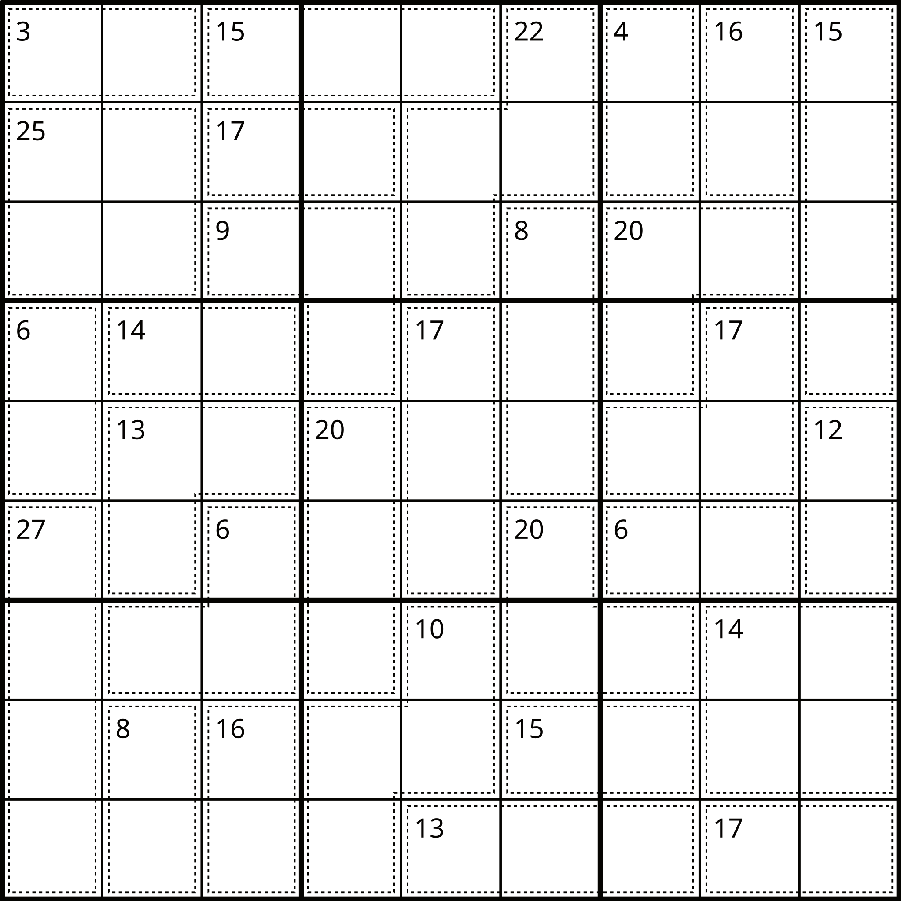
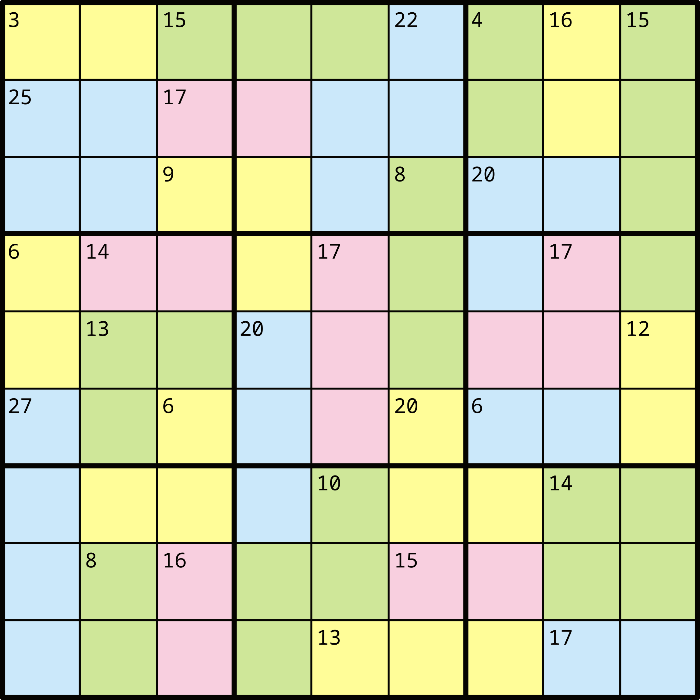
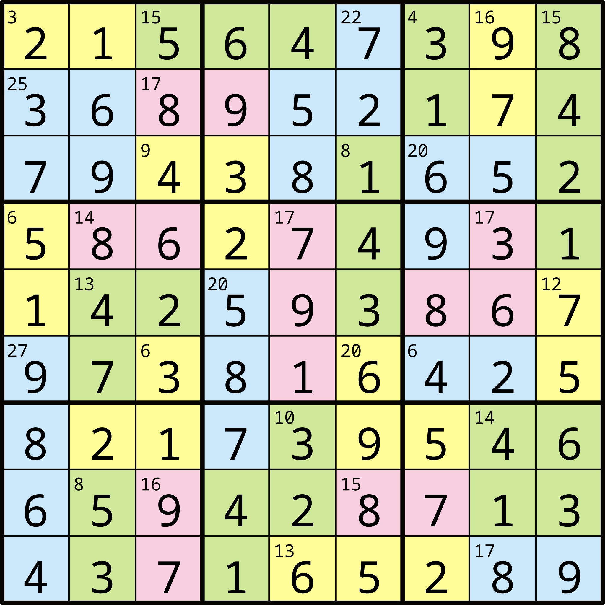

# [Killer Sudoku Grid](https://en.wikipedia.org/wiki/Killer_sudoku)

[Back to README.md](../README.md)

[Back to Documentation Index](./README.md)

## Rules of Killer Sudoku

> The objective is to fill the grid with numbers from 1 to 9 in a way that the following conditions are met:
>
> * Each [row](./Terminology.md#Row), [column](./Terminology.md#Column), and [nonet](./Terminology.md#Nonet) contains each number exactly once.
> * The sum of all numbers in a [cage](./Terminology.md#Cage) must match the small number printed in its corner.
> * No number appears more than once in a [cage](./Terminology.md#Cage). (This is the standard rule for killer sudokus, and implies that no [cage](./Terminology.md#Cage) can include more than 9 [cells](./Terminology.md#Cell).

## Examples of Killer Sudoku Grids

<table>
  <colgroup>
    <col span="3" style="width: 33%;">
  </colgroup>

  <thead>
    <tr>
      <th>Example Killer Sudoku Grid</th>
      <th>Example Killer Sudoku Grid With Colour</th>
      <th>Example Killer Sudoku Grid Solved</th>
    </tr>
  </thead>
  <tbody>
    <tr>
      <td style="text-align: center; vertical-align: middle;">  </td>
      <td style="text-align: center; vertical-align: middle;">  </td>
      <td style="text-align: center; vertical-align: middle;">  </td>
    </tr>
  </tbody>

</table>