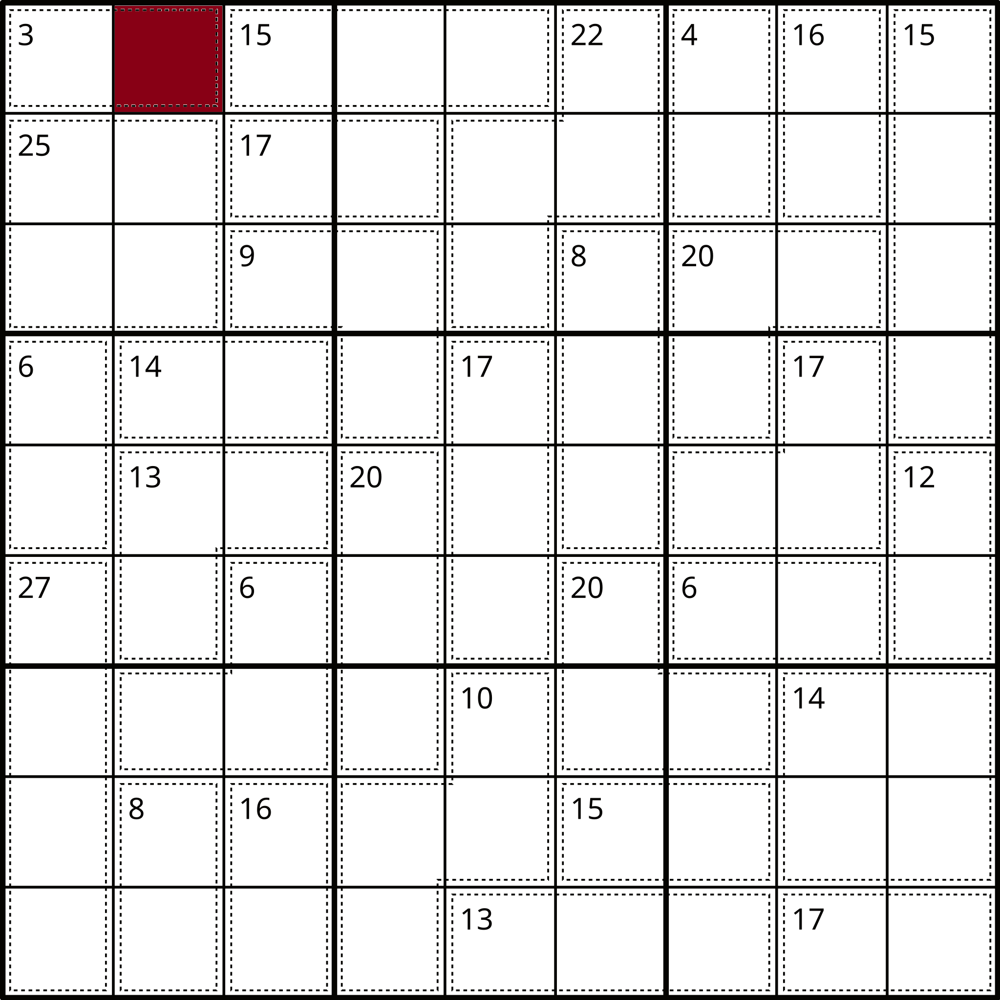

# [Terminology](https://en.wikipedia.org/wiki/Glossary_of_Sudoku)

[Back to README.md](../README.md)

[Back to Documentation Index](./README.md)

> Below are examples of the technical names of what we will be describing in the domain space of sudoku.

## Cell

> A single square that contains one number in the grid

<table>
  <colgroup>
    <col span="3" style="width: 33%;">
  </colgroup>

  <thead>
    <tr>
      <th>Example Sudoku Grid Cells</th>
      <th>Example Sudoku Grid Cell Coloured</th>
      <th>Example Sudoku Grid Cell Coloured With Value Set</th>
    </tr>
  </thead>
  <tbody>
    <tr>
      <td style="text-align: center; vertical-align: middle;">  </td>
      <td style="text-align: center; vertical-align: middle;">  </td>
      <td style="text-align: center; vertical-align: middle;">  </td>
    </tr>
  </tbody>

</table>

## Row

> A horizontal line of 9 cells

## Column

> A vertical line of 9 cells

## Nonet

> A 3×3 grid of cells, as outlined by the bolder lines in the diagram above; also called a box

## Cage

> The grouping of cells denoted by a dotted line or by individual colours.

## House

> Any non-repeating set of 9 cells: can be used as a general term for "row, column, or nonet" (or, in Killer X variants, "long diagonal")